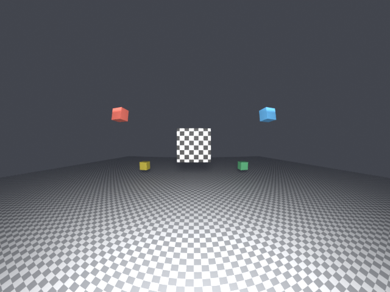
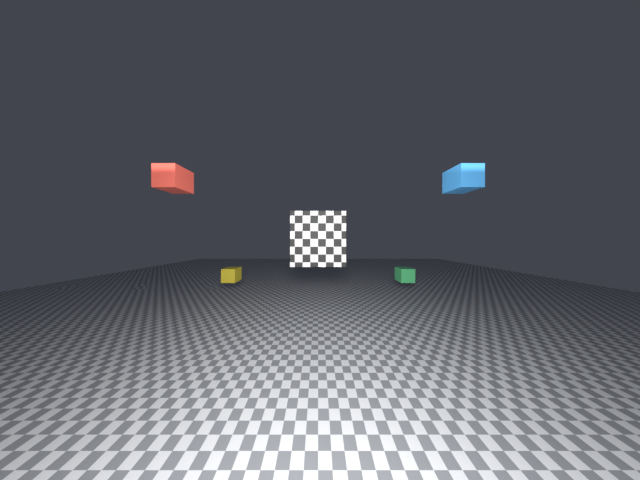

# blender-vision-sim

Blender 视觉算法仿真插件集合：用 Blender/Cycles 生成**与真实相机、真实传感器一致**的合成数据，用于感知算法的开发、标定与回归验证。

仓库以「插件 + 纯 Python 核心」的方式组织：算法数学与文件格式放在不依赖 `bpy` 的 `core/`，Blender 集成（属性、着色器、算子、UI）放在 `bl/`，因此核心逻辑可以在 Blender 之外单测，也能被导出工具、标定工具复用。

## 插件列表

| 插件 | 状态 | 说明 |
| --- | --- | --- |
| [`opencv_camera`](addons/opencv_camera) | 0.1.0 可用 | Cycles 自定义相机，支持 OpenCV 内参（fx/fy/cx/cy）与畸变（**fisheye / Brown-Conrady / rational**），可导入导出标定文件、设置 OpenCV 外参、一键生成验证场景、渲染自检 |
| `camera_rig` | 规划中 | 多相机刚体（外参）、同步渲染、标定数据集导出 |
| `sensor_sim` | 规划中 | IMU / GNSS / LiDAR 轨迹与噪声仿真 |
| `dataset_export` | 规划中 | 渲染 + 真值导出（位姿/内参/深度/分割），KITTI / COLMAP / EuRoC 布局 |
| `calibration_tools` | 规划中 | 场景内标定板、角点/ArUco 反标定回环验证 |

路线图见 [`docs/roadmap.md`](docs/roadmap.md)。

### 入口与图标

菜单图标是**单色线条风格的一套图标**（`scripts/make_icon.py` 纯 Python 生成，无 Pillow 依赖），
每个菜单项各有其形，16 px 下也能分辨：

| 图标 | 用于 | 形状 |
| --- | --- | --- |
| `visionsim` | `Add ▸ VisionSim` | 眼睛 + 实心瞳孔 |
| `camera` | `VisionSim ▸ Camera` | 相机机身 + 镜头 |
| `fisheye` | Fisheye 条目 | 圆 + 外弓十字（广角） |
| `brown_conrady` | Brown-Conrady 条目 | 方 + 外弓十字 |
| `rational` | Rational 条目 | 方 + 外弓十字 + 中心点（高阶项） |
| `pinhole` | Pinhole 条目 | 方 + 笔直十字 |
| `camera_scene` | Camera Scene | 立方体轮廓 |

这些都是**原创标识**（不是 OpenCV 商标本身），想改图案改脚本里的形状定义后重跑：

```bash
python3 scripts/make_icon.py     # 重新生成 addons/opencv_camera/icons/visionsim.png
```

图标通过 `bpy.utils.previews` 载入并用 `icon_value` 使用；无 UI 的会话（后台/测试）拿不到有效
icon id，此时自动回退到 Blender 内置图标，不会出现空白按钮。

## 目录结构

```text
blender-vision-sim/
├── addons/<addon_id>/           # 每个插件一个 4.2+ Extension 包
│   ├── blender_manifest.toml    # Extensions 规范清单（唯一的插件元数据来源）
│   ├── __init__.py              # 只做 register / unregister 编排
│   ├── core/                    # 纯 Python：模型、变换、IO（禁止 import bpy）
│   ├── bl/                      # Blender 集成：properties / shader / apply / selftest / ui / operators
│   └── shaders/*.osl            # 随插件分发的 OSL 源文件（权威副本）
├── docs/                        # 架构、相机模型、路线图
├── scripts/                     # dev_install / dev_uninstall / package / run_tests
└── tests/                       # 纯 Python 单测 + 无头 Blender 集成测试
```

## 快速开始

```bash
# 1. 链接到 Blender 的 User Default 扩展仓库（默认 4.5，可用 -v 指定版本）
scripts/dev_install.sh

# 2. 启动 Blender → Preferences ▸ Add-ons，启用 "OpenCV Camera"
#    或使用 Python：
#    bpy.ops.preferences.addon_enable(module='bl_ext.user_default.opencv_camera')

# 3. 打包成可分发/可安装的 zip
scripts/package.sh

# 4. 跑全部测试
scripts/run_tests.sh
```

Blender 中使用：

1. 选中相机对象 ▸ `Object Data Properties ▸ Lens ▸ OpenCV Camera`；
2. 选畸变模型（默认 `Fisheye (equidistant)`）、填 fx/fy 与系数（或 `Import Calibration` 导入标定文件，
   仓库自带参考标定 `addons/opencv_camera/presets/default_camera.yaml`）；
3. 点 `Apply` —— 插件会写入对应 OSL 着色器、编译、把参数送进 Cycles；
4. `Add ▸ VisionSim  Camera Scene` —— 生成棋盘方块 + 棋盘地面 + 灯光并设好 Cycles，直接 F12 看畸变效果
   （场景里没有相机时会自动先建一台鱼眼相机）；
5. 点 `Run Self Test` —— 渲染目标并与 OpenCV 模型比对，报出像素误差（参考相机实测 0.03–0.08 px）。

> 自定义相机只在 **Cycles** 下生效，且只能使用 **CPU 或 OptiX** 后端（macOS 无 OptiX ⇒ 只能 CPU）。
> 默认参数取真实 AVM 前相机（1280×960 鱼眼），直接可用；换成自己的标定即可。

### 三种使用方式

| 方式 | 操作 |
| --- | --- |
| **新建相机**（推荐） | `Add ▸ VisionSim ▸ Camera ▸ Fisheye / Brown-Conrady / Rational / Pinhole`，创建出来即为 Custom 相机、已挂载着色器与参数，可选 `At 3D Cursor` / `Add Rig Empty`（父级空物体，便于多相机/外参）。同一菜单下还有 `Camera Scene`（棋盘方块/地面/灯光） |
| **改造现有相机** | 选中相机  `CV Camera ▸ Apply` |
| **批量/脚本** | `bpy.ops.opencv_cam.add_camera(model="fisheye", preset="default_camera", use_rig=True)` |

> Blender 不允许插件扩展 `Camera.type` 枚举（该枚举定义在 C 侧 RNA），所以"添加自定义相机"以
> `Add ▸ Camera` 菜单算子的形式提供，这是 Blender 插件生态里的标准做法；相机数据块本身仍是
> `Lens Type = Custom` + 我们的 OSL 着色器。

### 输出图像尺寸

`Output Image` 面板专门管"模拟真实摄像头的输出尺寸"：

| Output Size | 含义 |
| --- | --- |
| `Calibration Size`（默认） | 直接按内参标定时的那套分辨率输出（例如参考相机 1280×960） |
| `Custom` | 从预设选（1280×960 / 1920×1080 / 1280×720 / 640×480 / 3840×2160 / 1920×1200）或手填宽高 |
| `Scene Settings` | 不动 Blender 的渲染分辨率，跟随场景 |

- `Drive Scene Resolution`（默认开）：每次应用参数时把输出尺寸写进 `scene.render.resolution_*`，
  所以 **F12 出来的就是相机原生尺寸**；关掉则只在插件里记录。
- `Set Render Resolution` / `From Scene` 两个按钮用于双向同步。
- 缩放策略（面板会实时提示）：**宽高比一致 → 等比缩放**（FOV 不变）；**宽高比不一致 → 保持像素尺度的中心裁剪**，
  避免把图像拉伸。预览与自检也按输出尺寸的宽高比走。
- `Add Camera` / `Load Preset` / `Reset Defaults` 都会顺带把场景分辨率设成该相机的输出尺寸。

### 参数面板与预览

- **Live Apply**（默认开）：面板上改任意内参/畸变/外参即时写入 Cycles，不需要再点 Apply；
  外参面板改 `R`/`t` 会同步移动相机物体；`Model` 切换会自动换着色器并重编译。
- **Preview**：按**输出宽高比**快速渲染并显示在 Blender 的 Image Editor 里（与 F12 同一位置），
  **渲染设置用完即还原**，Preview 不会改动你的场景设置；其中
  `Preview Size`（256/384/512/720）是**预览图的分辨率长边**（短边按输出宽高比推导，面板会显示实际
  预览尺寸），`Preview Samples`/`Denoise Preview` 控制预览的噪声与速度 —— 这三项只作用于
  **预览与 Save Preview Image**，F12 的最终尺寸由 `Output Image` 决定、采样数用场景自己的设置；
  `Save Preview Image` 可落盘 PNG；`Preview On Change` 打开后停止拖动约 0.6 s 自动重渲染。
- 面板同时显示：当前生效的着色器/字节码长度、分辨率与宽高比提示、自检结果。
- 用 `Save Preview Image` 落盘的预览图示例：`docs/images/preview_example.png`（384×288，16 采样）。
- 注意：Blender 4.x 已移除 `UILayout.template_preview` / `Image.preview`，插件无法在面板里内嵌图片，
  因此预览走 Image Editor；3D 视口是否支持自定义相机**尚未实测确认**（视口渲染需要交互式刷新），
  所以暂不作为预览方案（见 `docs/roadmap.md` 待办）。

### 面板结构

所有模块都是 camera 数据属性里的**顶层面板**（与 Blender 自带的 Lens 等平级，不嵌套），统一用
`CV ` 前缀，并用**负的 `bl_order` 排在最前面**：

```
Object Data Properties
├── CV Intrinsics   模型、fx fy cx cy、畸变（模型 + 系数 + 迭代 + Discard Invalid Rays）、
│                   标定分辨率 + From Blender Lens、生效值只读框，
│                   然后才是 [Apply] [Preview] [Live Apply] [Recompile] 与状态框
├── CV Extrinsics   Euler（XYZ 三轴角度）/ R / t、Apply Pose / Read Pose
│                   ├── OpenCV Pose：R / t（与上面的角度分开成两组）
│                   └── World Frame（可折叠）：自定义世界系开关 + 4×4 矩阵
├── CV Presets      标定文件 [Import] / [Export]、Load Preset、Reset Defaults（默认折叠）
├── CV Preview      预览尺寸/采样/去噪/自动预览、Save Preview、Self Test（默认折叠）
├── CV Output       输出尺寸（标定/自定义/跟随场景）、驱动场景分辨率、Set/From Scene
── Lens / Camera / Depth of Field ...      （Blender 自带面板排在后面）
```

- 参数在前、动作在后：`Apply` / `Preview` / `Live Apply` / `Recompile` 都在 `CV Intrinsics` 的参数之后。
- `enable_distortion` 这类开关在**本插件面板里是真复选框**（`distortion.enabled`、`discard_invalid_rays`）。
- Cycles 依据 OSL 形参自动生成的那串裸参数列表默认**被隐藏**（值以数字显示、且 Cycles 对自定义相机
  参数不支持复选画法），需要时打开 `Show Cycles Raw Parameters` 即可恢复显示。
- `Discard Invalid Rays`：反畸变迭代发散时（极强畸变、或像素远超标定域）**丢弃该射线**（画面变黑），
  而不是保留一个勉强算出来的方向；默认关闭（保留 best effort），需要严格边缘行为时打开。

### 可视化验证

`Add ▸ VisionSim ▸ Camera Scene` 生成的场景（同一套 K，仅切换畸变开关）：

| 鱼眼（`fisheye`, k1..k4） | 理想针孔（`enable_distortion = 0`） |
| --- | --- |
|  |  |

地面网格的弯曲程度就是鱼眼畸变的直接体现；两图均可用 `docs/camera-model.md` 中的公式复算。

## 开发约定

- 插件采用 Blender 4.2+ **Extension** 规范（`blender_manifest.toml`），不使用 `bl_info`；
- 插件内部**只用相对导入**（扩展模式下包名是 `bl_ext.<repo>.<id>`，绝对导入会失效）；
- `core/` 不得 `import bpy`；`bl/` 才可以访问 `bpy` / `mathutils`；
- 插件自有 PropertyGroup 是参数的唯一真源，`camera.cycles_custom[...]` 只作为写入目标；
- 任何写 Cycles 参数的路径都必须校验 `custom_bytecode` 非空（编译失败会**静默沿用旧着色器**）；
- 新增/修改行为都要有测试：核心逻辑进 `tests/test_core.py`，需要渲染的进 `tests/run_blender_tests.py`。

细节见 [`docs/architecture.md`](docs/architecture.md)，相机模型推导与实测数据见 [`docs/camera-model.md`](docs/camera-model.md)。

## 实测结论（Blender 4.5.3 LTS, Cycles CPU）

| 验证 | 结果 |
| --- | --- |
| 零畸变自定义相机 vs 自带透视相机（128×128，50mm/36mm） | 16384/16384 像素完全一致（max\|Δ\| = 0） |
| 主点偏移等价性（shift_x=0.1, shift_y=0.15） | 完全一致（cx=51.2, cy=83.2 px） |
| 多项式畸变目标成像位置 vs OpenCV 前向模型 | 误差 0.018 px |
| 鱼眼（AVM 前相机，θ≈72°） | 误差 0.048 px |
| 鱼眼贴近 90° 边界（θ≈87°，射线用 sin/cos） | 误差 0.026 px |
| 分辨率换算（同比 1920×1080 → 960×540） | fx 按比例缩放，FOV 保持；宽高比不一致时自动改为原始像素尺度的中心裁剪 |

## 许可

GPL-3.0-or-later（与 Blender 插件生态一致）。